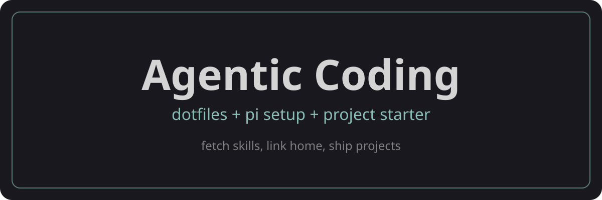

  

  
  

# Agentic Coding

Personal dotfiles + pi/project setup. Skills fetched upstream, not vendored.

## What's inside

| Path | Purpose |
|------|---------|
| `home/` | Mirrors `$HOME` — `AGENTS.md`, `.pi/agent/settings.json`, theme, extension. Symlinked, never copied. |
| `skills.manifest.json` | Hand-selected skill profiles (`base`/`pythondev`/`devops`) mapping to upstream sources. |
| `skills/gpt-imagegen/` | Only local skill. |
| `template/project/` | Starter `.pi/settings.json` + `AGENTS.md` for new repos. |
| `setup.sh` | Single script: `--user` (dotfiles) or `--project` (bootstrap). Interactive too. |
| `get-started.sh` | `curl … \| bash` one-liner. |

## Quick start

**New laptop:** `curl -fsSL https://raw.githubusercontent.com/HGZahn/agentic-coding/master/get-started.sh | bash`

**With mise:** `git clone git@github.com:HGZahn/agentic-coding.git && cd agentic-coding && mise install && mise run setup-all`

**Dotfiles only:** `./setup.sh --user --no-skills` or `mise run setup`

**New project:** `./setup.sh --project /path/to/repo` or `mise run init`

**Check drift:** `./setup.sh --user --check` or `mise run doctor`

## pi + OpenCode

Both read from the same shared skill paths — pi natively (`~/.pi/agent/skills/`, `~/.agents/skills/`) and OpenCode through `.agents/skills`. No `.opencode/skills` symlink hack needed.

## Flags

`--user` / `--project` accept: `--check`, `--apply`, `--adopt`, `--no-skills`, `--profiles X,Y`, `--agents X,Y`.

## Skills

Third-party `npx skills` is the installer/updater/manager. No custom manager.

- `mise run skills-list` / `mise run skills-update`
- Profiles: `base`, `pythondev`, `devops`
- Edit `skills.manifest.json`, rerun `./setup.sh --user`

## License

MIT